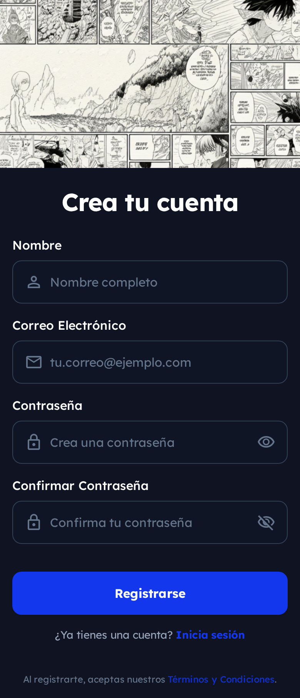
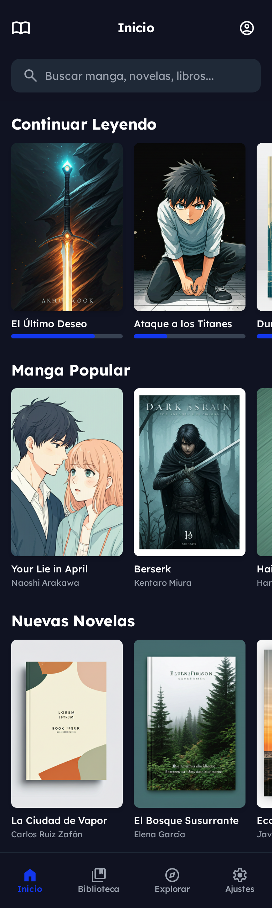
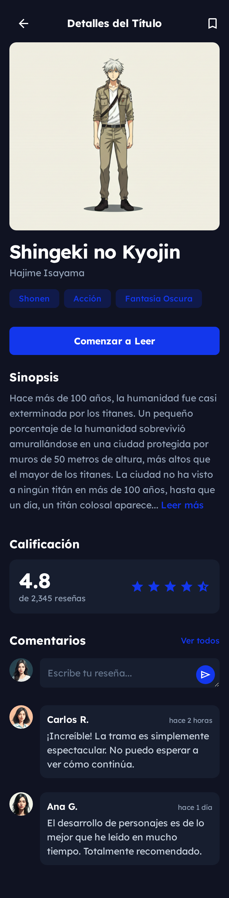
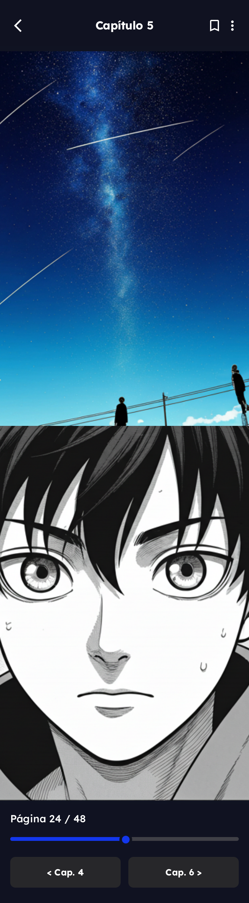
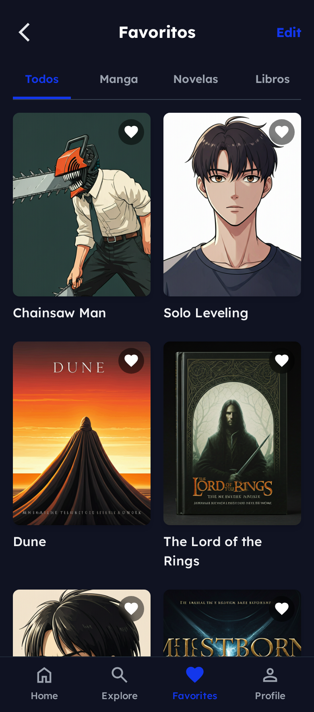
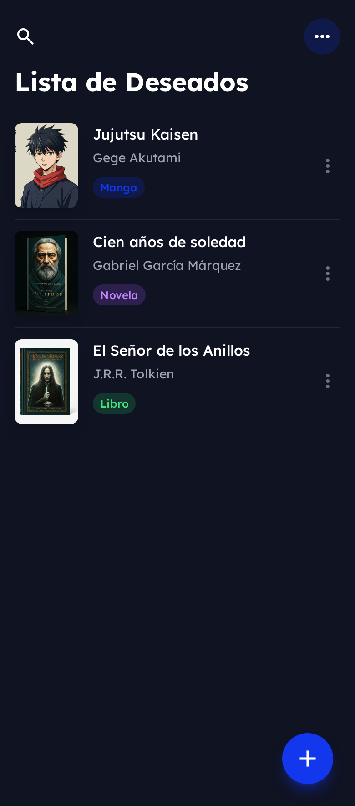
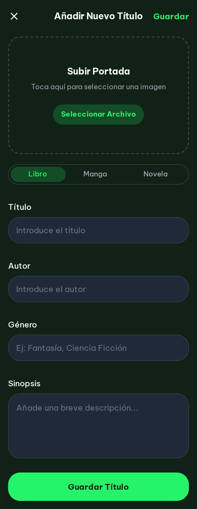
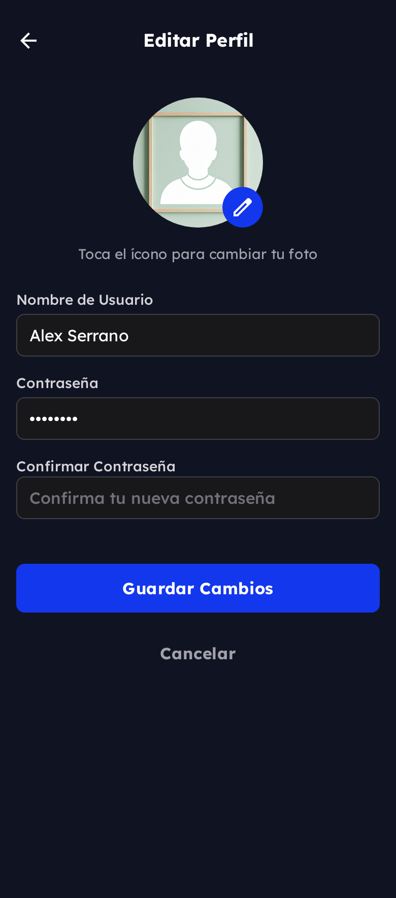

# 📚 Biblioteca Digital 

Prototipo de interfaz disenado para una experiencia sencilla de lectura y administracion de libros anime.

## 🎯 Descripcion del Proyecto
Este repositorio contiene un prototipo UI creado primero en Stitch y luego implementado en HTML y CSS. El flujo se centra en la gestion basica de usuarios y libros: registro, seleccion, favoritos, y configuracion del perfil.

Flujo Principal de Navegacion
```
Registro
↓
Pantalla principal con libros
↓
Seleccion de libro
↓
Seleccion de capitulo
↓
Agregar a favoritos
↓
Lista de libros
↓
Agregar libro
↓
Editar perfil

```

## Pantallas del Prototipo

1. 📝 **Registro**  
Pantalla para crear una nueva cuenta con un formulario simple. Es el punto inicial del usuario.  


2. 📚 **Pantalla principal con libros**  
Vista general donde se muestran todos los libros disponibles. Desde aquí se puede acceder a detalles.  


3. 📖 **Selección de un libro**  
Muestra la información del libro elegido: portada, descripción, autor y botones de acción.  


4. 📄 **Selección de capítulo**  
Lista de capítulos disponibles del libro seleccionado. Permite ir al contenido.  


5. ⭐ **Agregar a favoritos**  
Acción para guardar el libro en la lista personal del usuario.  


6. 📘 **Lista de libros**  
Muestra los libros guardados o favoritos del usuario. Permite organizarlos y acceder rápidamente.  


7. ➕ **Agregar libro**  
Formulario para agregar nuevos libros a la plataforma. Incluye campos básicos como título, autor y categoría.  


8. 👤 **Editar perfil**  
Pantalla donde el usuario puede modificar su información personal, datos de cuenta y configuraciones básicas.  



## 🛠️ Tecnologías Utilizadas

- **Diseño:** Stitch (prototipado)
- **Frontend:** HTML5, CSS3
- **Metodología:** Mobile-first, diseño responsivo

## 📦 Estructura del Proyecto

```
/
├── docs/
│   ├── AgregarLibro.png
│   ├── favoritos.png
│   ├── index.png
│   ├── Libro.png
│   ├── Lista.png
│   ├── Perfil.png
│   ├── register.png
│   ├── VistaLibro.png
│   └── ui_prototipo_stitch.md
│
├── ui-stitch/
│   ├── css/
│   ├── js/
│   ├── AgregarLibro.html
│   ├── favoritos.html
│   ├── index.html
│   ├── libro.html
│   ├── lista.html
│   ├── perfil.html
│   ├── register.html
│   └── VistaLibro.html
│
└── README.md
```

